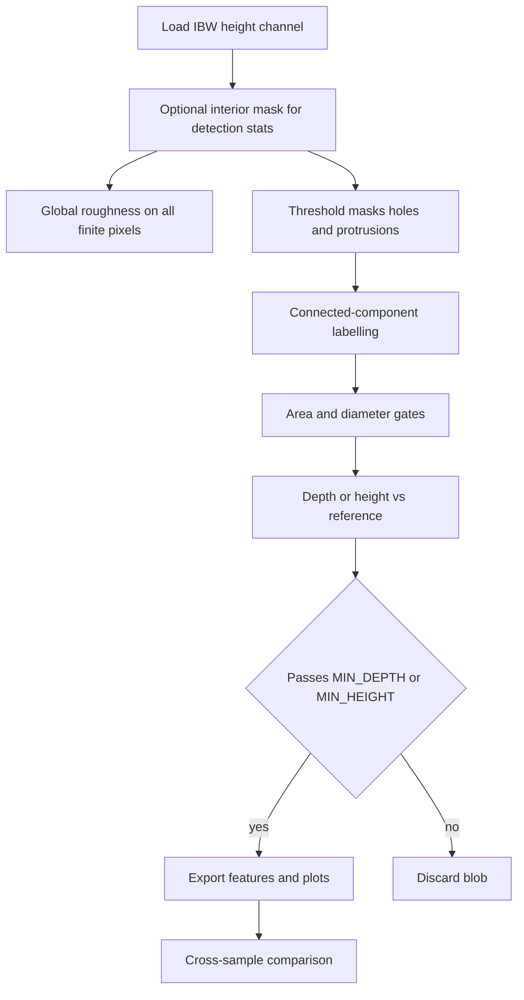

# AFM 3D Surface Analyser

Batch analysis of Atomic Force Microscopy (AFM) height maps from Asylum Research / Igor Binary Wave (`.ibw`) files.

The tool segments putative **holes** (valleys) and **protrusions** (peaks), measures geometry and roughness, exports CSV tables, and builds interactive Plotly comparison figures. A desktop GUI is included for live threshold preview and batch runs.

This README is both a **user manual** and a **methods appendix** suitable for citation in a thesis or journal article. Parameters named below match symbols in `main.py` unless noted.

> **Important:** no plane-fitting is applied inside this software. All `.ibw` files must already be **pre-levelled** (Igor, Gwyddion, or the microscope software) before analysis.

---

## Contents

1. [What it does](#what-it-does)
2. [Requirements](#requirements)
3. [Installation](#installation)
4. [Quick start](#quick-start)
5. [Data layout and naming](#data-layout-and-naming)
6. [Using the GUI](#using-the-gui)
7. [Batch processing (no GUI)](#batch-processing-no-gui)
8. [Configuration](#configuration)
9. [Outputs](#outputs)
10. [Algorithmic pipeline](#algorithmic-pipeline)
11. [Methodology](#methodology)
12. [Limitations](#limitations)
13. [Project layout](#project-layout)

---

## What it does

For each `.ibw` height channel the analyser:

- Loads height in **nanometres** and lateral scale from the Igor wave header
- Computes areal roughness moments (\(R_a\), \(R_q\), \(R_z\), \(R_{pv}\), skewness, kurtosis)
- Thresholds holes and protrusions (classical mean/SD or robust median/MAD)
- Labels connected components and applies area, diameter, depth/height, and border gates
- Exports per-feature CSVs plus 2D / 3D / roughness Plotly HTML
- Builds cross-sample comparison plots, including optional **substrate vs coating** pairing

The GUI adds:

- **Single Preview** — live overlay of hole/protrusion masks while you move SD sliders
- **All Images** — grid of every scan in the data folder
- **Run Analysis** — launches the same batch pipeline as `main.py`, with GUI options passed as environment variables

---

## Requirements

| Item | Notes |
|------|--------|
| **Python** | 3.10 or newer (64-bit) |
| **OS** | Windows, macOS, or Linux. The GUI uses `tkinter` (included with standard CPython on Windows). |
| **Data** | Pre-levelled Asylum / Igor `.ibw` height maps |
| **Optional** | [kaleido](https://pypi.org/project/kaleido/) if you enable Plotly PNG export (`SAVE_PNGS`) |

Python packages (see `requirements.txt`): `numpy`, `pandas`, `scipy`, `plotly`, `igor2`, `matplotlib`.

---

## Installation

```powershell
git clone https://github.com/Craig-Venables/afm-3d-holes-protrusion.git
cd afm-3d-holes-protrusion
py -3.10 -m pip install -r requirements.txt
```

If `pip` is not on your PATH, always invoke it through the interpreter:

```powershell
py -3.10 -m pip install -r requirements.txt
```

A virtual environment is recommended but not required:

```powershell
py -3.10 -m venv .venv
.\.venv\Scripts\Activate.ps1
python -m pip install -r requirements.txt
```

---

## Quick start

1. Put pre-levelled `.ibw` files under `Data/` (see [layout](#data-layout-and-naming)).
2. Launch the GUI:

```powershell
py -3.10 launch_gui.py
```

3. Confirm the **Data** folder, tune **Hole SD** / **Prot SD** on a preview, then click **Run Analysis**.
4. Open the latest `Output/Run_<timestamp>/` folder (or use **Open Output Folder**).

To run the batch analyser without the GUI:

```powershell
py -3.10 main.py
```

`main.py` always reads `Data/` next to the script and writes timestamped runs under `Output/`.

---

## Data layout and naming

Each **subfolder** of `Data/` is one comparison experiment. Files in several folders may be duplicates — that is intentional. Loose `.ibw` files directly in `Data/` are processed as experiment `unnamed`.

```
Data/
├── glass_vs_glass_ito/
│   ├── Glass_0001.ibw
│   ├── Glass_0002.ibw
│   ├── Glass_ITO_0001.ibw
│   └── Glass_ITO_0002.ibw
├── glass_vs_si/
│   ├── Glass_0001.ibw
│   └── Si_0001.ibw
└── quartz_bare/
    └── Quartz_0001.ibw
```

**Naming convention** (trailing replicate numbers are stripped automatically via `REPLICATE_STRIP_PATTERN`):

| Role | Filename example | `base_sample_name` | Parsed as |
|------|------------------|--------------------|-----------|
| Bare substrate | `Glass_0001.ibw` | `Glass` | baseline |
| With coating | `Glass_ITO_0001.ibw` | `Glass_ITO` | deposit on `Glass` |
| PMMA on Si | `Si_PMMA_0001.ibw` | `Si_PMMA` | deposit on `Si` |

Use `_` to separate substrate from deposited layer (`Glass_ITO`, `Glass_PMMA`, `Si_ITO`). The substrate token is whatever comes before the first underscore (`Glass`, `Quartz`, `Si`, …).

**Optional baseline override:** if auto-pairing is ambiguous, add a one-line `baseline.txt` in the comparison folder containing the exact `base_sample_name` of the reference scan (e.g. `Glass`).

Raw `.ibw` files are gitignored and are not committed to this repository.

---

## Using the GUI

```powershell
py -3.10 launch_gui.py
```

| Control | Purpose |
|---------|---------|
| **Data / Output** | Browse folders. Defaults: `Data/` and `Output/` next to the scripts. |
| **Hole SD / Prot SD** | Multipliers \(N_h\), \(N_p\) for detection thresholds. The single-file preview updates live. |
| **Use robust stats** | Median + MAD-scaled spread instead of mean / standard deviation. |
| **Per-sample / comparison checkboxes** | Which Plotly figures to generate. |
| **Substrate comparison** | Pair bare substrates with coated samples (see naming above). |
| **Save PNGs** | Also write static PNGs (needs `kaleido` for Plotly images). |
| **Run Analysis** | Starts `main.py` as a subprocess; log appears in the bottom pane. |
| **All Images** | Click **Load / Refresh All Images** after changing thresholds — the grid does not auto-refresh. |

The GUI passes settings to `main.py` as `AFM_GUI_*` environment variables (`HOLE_THRESHOLD_SD`, plot flags, and so on). Values in the `CONFIGURATION` block of `main.py` remain the defaults when you run the batch script directly.

---

## Batch processing (no GUI)

Edit the `CONFIGURATION` block at the top of `main.py`, then:

```powershell
py -3.10 main.py
```

The script:

1. Discovers every experiment folder under `Data/` that contains `.ibw` files
2. Writes `Output/Run_<YYYY-MM-DD_HH-MM-SS>/<experiment>/...`
3. Builds per-sample plots, a `comparison/` folder, and merged HTML dashboards

---

## Configuration

Open `main.py` and adjust the variables at the top under `CONFIGURATION`. The most important knobs:

| Variable | Role |
|----------|------|
| `CHANNEL` | IBW height channel index (default `0`). |
| `HOLE_THRESHOLD_SD` / `PROT_THRESHOLD_SD` | Multipliers \(N_h\), \(N_p\) ([§2.5](#25-segmentation-binary-masks-for-holes-and-protrusions)). |
| `USE_ROBUST_THRESHOLD` | Median and MAD-scaled spread ([§2.5.2](#252-robust-thresholds-median--mad)). |
| `ANNULUS_WIDTH_NM` / `ANNULUS_WIDTH_PX` | Rim dilation for hole depth; both `0` ⇒ depth vs global mean. |
| `MIN_EQUIV_DIAMETER_NM` | Minimum hole equivalent diameter (nm); `0` = off. |
| `MIN_AREA_PX` | Minimum blob area in pixels. |
| `MIN_DEPTH_NM` / `MIN_HEIGHT_NM` | Amplitude gates ([§2.8](#28-amplitude-hole-depth-and-protrusion-height)). |
| `EDGE_EXCLUDE_NM` / `EDGE_EXCLUDE_PX` | Interior crop for detection ([§2.3](#23-domains-full-image-vs-interior-detection-only)). |
| `REJECT_FEATURES_TOUCHING_IMAGE_BORDER` | Discard blobs that touch the raster edge. |
| `PLOT_*` / `SAVE_PNGS` | Which HTML / PNG figures to write. |
| `DOWNSAMPLE_3D` | Max pixels per side for the 3D surface plot. |

### Defect density columns

| Column | Meaning |
|--------|---------|
| `holes_per_um2` | Hole count / scan area |
| `prots_per_um2` | Protrusion count / scan area |
| `defects_per_um2` | Combined holes + protrusions / scan area |
| `defects_per_mm2` | Same as above × 10⁶ (reporting convenience) |

---

## Outputs

Results are written under a timestamped run folder:

```
Output/Run_<YYYY-MM-DD_HH-MM-SS>/<experiment_name>/...
```

### Per-sample (`…/<experiment>/<sample>/<replicate>/`)

| File | Contents |
|------|----------|
| `holes.csv` / `protrusions.csv` | Per-feature area, equivalent diameter, depth/height, centroid. Hole rows may include `depth_reference` (`annulus` / `global` / `global_fallback`) and `hole_rim_z_nm`. |
| `height_map_2d.html` / `.png` | False-colour 2D height map |
| `height_map_3d.html` / `.png` | Interactive 3D surface |
| `feature_map.html` / `.png` | Overlay: holes blue, protrusions orange |
| `histograms.html` / `.png` | Size / depth / height distributions |
| `roughness_analysis.html` / `.png` | Height histogram with Gaussian fit, roughness table, scan-quality scores |
| `all_plots_dark.html` / `all_plots_light.html` | Merged dashboards |

### Cross-sample (`…/<experiment>/comparison/`)

Grouped by `base_sample_name` (replicate indices stripped). Files are **reloaded** and detection is **re-run** in the threshold-review HTML so that view matches the current settings.

- `{base_sample_name}_replicates/threshold_review_grid_light.html` — one row per replicate: Viridis height map + greyscale overlay
- Single-scan bases: `threshold_review_<slug>_light.html`
- `summary.csv` — one row per file, including `ibw_path`
- `surface_coverage.html` / `surface_coverage_box.html`
- `feature_density.html`
- `substrate_delta_summary.csv`, `substrate_defect_density.html`, `substrate_delta_chart.html`
- `roughness_comparison.html`, `rq_box.html`
- `stats_overview.html`, `depth_vs_diameter.html`, `ranking_table.html`
- `*_box.html` — depth / diameter box plots
- `origin data/*.txt` — Origin-compatible tab-separated tables
- `all_plots_dark.html` / `all_plots_light.html`

---

## Algorithmic pipeline

Each scan is treated as a discrete sampling \(z_{ij}\) of surface height (nanometres) on a rectangular pixel lattice.



---

## Methodology

### 2.1. Purpose and scope of the model

The software answers an **operational** question: given a **single topographic image** per scan (already flattened in external software), which pixels belong to statistically extreme lows (“holes”) or highs (“protrusions”), and how large are those regions in physical units?

It does **not** perform blind tip–sample deconvolution, nor does it classify chemistry or material phases. Any interpretation as “true nanoscale voids” requires corroboration (independent scans, line profiles, complementary microscopy, or physics-based models). What is rigorously defined here is **thresholded topography relative to a chosen global reference** on the field of view.

### 2.2. Input data and preprocessing assumptions

**File format.** Heights are read from `.ibw` via `igor2`; the selected wave (`CHANNEL`, default index `0`) is interpreted as height in metres and converted to **nanometres**.

**Lateral scale.** Pixel spacing (nm) is taken from the wave header (`sfA`). The implementation assumes a **square pixel grid**: one lateral scale applies to both axes. Scan extent follows as \(L_x = n_x \cdot \Delta x\), \(L_y = n_y \cdot \Delta y\) (µm in summaries).

**Plane levelling.** **No least-squares plane subtraction or line-by-line levelling is applied inside this script.** The thesis text should state explicitly that scans were **pre-levelled** (e.g. in Igor, Gwyddion, or the microscope software) before export. All thresholds and roughness moments are therefore computed from the **levelled height field** provided.

**Missing data.** Non-finite pixels (`NaN`) are excluded from masks where noted.

### 2.3. Domains: full image vs interior (detection only)

Two spatial domains appear:

1. **Full valid support** \(\Omega_{\mathrm{all}} = \{(i,j) : z_{ij}\ \text{finite}\}\) — used for **global roughness** (Section 2.4).
2. **Interior support** \(\Omega_{\mathrm{int}}\) — a central sub-rectangle obtained by **cropping** `EDGE_EXCLUDE_NM` (or `EDGE_EXCLUDE_PX`) from each border of the image. This suppresses common AFM frame artefacts (scanner bow, incomplete feedback at edges) from influencing detection statistics and from contributing masked “holes.”

If `THRESHOLD_USE_INTERIOR_ONLY` is `True` (default), **mean, standard deviation, median, and MAD** used for **thresholding** are evaluated **only on** \(\Omega_{\mathrm{int}}\). The binary masks are still restricted to \(\Omega_{\mathrm{int}}\) for classification (finite height required).

**Thesis wording suggestion:** *“Detection thresholds were estimated from the interior \(|\Omega_{\mathrm{int}}|\) pixels to reduce edge artefacts; global roughness moments were computed over all finite pixels unless otherwise stated.”*

### 2.4. Global roughness and height-distribution moments

Let \(\{z_k\}_{k=1}^{N}\) be all finite heights (typically over \(\Omega_{\mathrm{all}}\)). Define the sample mean \(\bar{z} = \frac{1}{N}\sum_k z_k\) and residuals \(\delta_k = z_k - \bar{z}\).

The implementation reports (among others):

| Symbol | Name | Definition (implemented) |
|--------|------|---------------------------|
| \(R_a\) | Arithmetic mean roughness | \(\frac{1}{N}\sum_k |\delta_k|\) |
| \(R_q\) | RMS roughness | \(\sqrt{\frac{1}{N}\sum_k \delta_k^2}\) |
| \(R_z\) | Range | \(\max_k z_k - \min_k z_k\) |
| \(R_{pv}\) | Robust peak–valley | \(P_{99}(\{z_k\}) - P_{1}(\{z_k\})\) |
| \(R_{sk}\) | Skewness (normalized) | \(\frac{1}{N}\sum_k \delta_k^3 / R_q^{\,3}\) (0 if \(R_q{=}0\)) |
| \(R_{ku}\) | Kurtosis (normalized) | \(\frac{1}{N}\sum_k \delta_k^4 / R_q^{\,4}\) (0 if \(R_q{=}0\)) |

Percentiles \(P_q\) are empirical. These quantities align with common ISO-style **areal** summaries when applied to a single AFM frame (see ISO 25178 for areal parameters).

**Interpretation.** \(R_{sk} < 0\) indicates an asymmetric distribution with a heavier **left** tail (more deep valleys than symmetric Gaussian texture would produce); \(R_{ku} > 3\) suggests heavier tails than Gaussian (“spiky” or strongly heterogeneous texture).

### 2.5. Segmentation: binary masks for holes and protrusions

Let \(\mathcal{S} \subseteq \Omega_{\mathrm{int}}\) be pixels used for **statistics** (by default \(\mathcal{S} = \Omega_{\mathrm{int}} \cap \Omega_{\mathrm{all}}\)).

#### 2.5.1 Classical (mean / standard deviation) thresholds

Sample mean \(\mu = \frac{1}{|\mathcal{S}|}\sum_{(i,j)\in\mathcal{S}} z_{ij}\) and sample SD \(\sigma = \sqrt{\frac{1}{|\mathcal{S}|}\sum_{\mathcal{S}}(z_{ij}-\mu)^2}\).

With user multipliers \(N_h=\)`HOLE_THRESHOLD_SD`, \(N_p=\)`PROT_THRESHOLD_SD`:

\[
T_{\mathrm{hole}} = \mu - N_h \sigma,\qquad T_{\mathrm{prot}} = \mu + N_p \sigma.
\]

Initial masks:

\[
M_{\mathrm{hole}} = \{(i,j)\in \Omega_{\mathrm{int}} : z_{ij} < T_{\mathrm{hole}}\},\quad
M_{\mathrm{prot}} = \{(i,j)\in \Omega_{\mathrm{int}} : z_{ij} > T_{\mathrm{prot}}\}.
\]

Under an ideal Gaussian texture model, \(N=3\) corresponds loosely to “beyond 99.7% of the bulk.” Real surfaces are non-Gaussian; \(N\) should be treated as a **tunable classification parameter**, justified by sensitivity analysis or by comparison to independent micrographs.

#### 2.5.2 Robust thresholds (median / MAD)

When `USE_ROBUST_THRESHOLD` is enabled, location is the **median** \(m = \mathrm{median}\{z_{ij} : (i,j)\in\mathcal{S}\}\). Let the median absolute deviation be

\[
\mathrm{MAD} = \mathrm{median}\{|z_{ij} - m| : (i,j)\in\mathcal{S}\}.
\]

The code uses a **Gaussian-consistency scale**

\[
\sigma_{\mathrm{rob}} = 1.4826 \times \mathrm{MAD},
\]

because for Gaussian data \(\mathrm{MAD}\) relates to the standard deviation by \(\sigma \approx 1.4826\,\mathrm{MAD}\). Thresholds become

\[
T_{\mathrm{hole}} = m - N_h \sigma_{\mathrm{rob}},\qquad T_{\mathrm{prot}} = m + N_p \sigma_{\mathrm{rob}}.
\]

**Fallback.** If \(\sigma_{\mathrm{rob}} = 0\) (degenerate flat interior, or MAD \(=0\)) but robust mode is still on, the implementation falls back to **median \(\pm N\cdot\sigma\)** using the classical \(\sigma\) on \(\mathcal{S}\). If robust mode is off, classical \(\mu \pm N\sigma\) is used.

**Rationale.** Rough or **heavy-tailed** height distributions inflate \(\sigma\); that pushes \(T_{\mathrm{hole}}\) downward and **inflates false hole area**. Robust spread reduces sensitivity to distant tails while preserving a single global threshold interpretable in “effective sigma” units.

#### 2.5.3 Why purely local SD thresholding was avoided as default

A common alternative thresholds each pixel against **local** mean and SD in a small window. When the window scale matches texture correlation length, **every valley becomes “\(N\) sigma below local mean”**, so the union of masks often equals **most of the image**. For that reason this pipeline defaults to **global** (or robust-global) thresholds on \(\mathcal{S}\), complemented by **physical gates** (area, diameter, depth) rather than pixel-wise local Normal tests.

### 2.6. Connected components and topology

Each binary mask is partitioned into **connected components** using `scipy.ndimage.label` with the **default structuring element** (four-neighbour connectivity on the pixel grid: horizontal and vertical adjacency only). Each component receives a unique integer label; disjoint depressed regions count as separate holes.

### 2.7. Post-segmentation rejection rules

For each labelled component \(R\):

1. **Minimum area (pixels).** If \(|R| <\) `MIN_AREA_PX`, discard (noise / quantisation speckle).
2. **Minimum equivalent diameter (holes only).** Equivalent diameter \(D_{\mathrm{eq}} = 2\sqrt{A/\pi}\) with \(A\) the physical area \(|R|\cdot (\Delta x)^2\) (nm²). If `MIN_EQUIV_DIAMETER_NM` \(>0\) and \(D_{\mathrm{eq}}\) is below that cutoff, discard.
3. **Image border.** If `REJECT_FEATURES_TOUCHING_IMAGE_BORDER` is `True`, discard components touching the outermost rows/columns of the **full** raster (distinct from the interior statistical mask).

These rules should be stated explicitly as **inclusion criteria** for reported defects.

### 2.8. Amplitude: hole depth and protrusion height

**Reference mean for measurement.** Feature measurement uses `background_mean = \mu` — the **classical interior mean** from `detect_features` (not the median). This keeps hole/protrusion amplitude comparable to the same \(\mu\) that appears in exported threshold diagnostics.

#### Holes

Let \(z_{\min}^{(R)} = \min_{(i,j)\in R} z_{ij}\).

- **Legacy depth** (annulus off): \(d^{(R)} = \mu - z_{\min}^{(R)}\) (non-negative for sub-mean pits).
- **Annulus depth** (when `ANNULUS_WIDTH_NM` or `ANNULUS_WIDTH_PX` \(>0\)): morphologically dilate \(R\) by an integer number of steps (connectivity-2 square structuring element). Let \(\mathrm{Ring}\) be dilated set minus \(R\). Then

  \[
  d^{(R)} = \max\left(0,\ \mathrm{median}\{z_{ij} : (i,j)\in \mathrm{Ring},\ z_{ij}\ \text{finite}\} - z_{\min}^{(R)}\right).
  \]

  If the ring carries no finite pixels, the code **falls back** to legacy depth vs \(\mu\) (`depth_reference` fields in CSV record this).

A component is **accepted** only if \(d^{(R)} \ge\) `MIN_DEPTH_NM`. Values **equal** to the cutoff are **retained** (`amplitude < MIN_DEPTH_NM` rejects).

#### Protrusions

Let \(z_{\max}^{(R)} = \max_{(i,j)\in R} z_{ij}\). Height \(h^{(R)} = z_{\max}^{(R)} - \mu\). Retained if \(h^{(R)} \ge\) `MIN_HEIGHT_NM`. **No annulus** is applied to protrusions in the current implementation.

### 2.9. Geometric descriptors exported per feature

For each accepted component \(R\):

- **Area** \(A\) (nm²): pixel count \(\times (\Delta x)^2\).
- **Equivalent diameter** \(D_{\mathrm{eq}}\) as above.
- **Centroid** \((x_c, y_c)\) (nm): mean column and row indices \(\times \Delta x\), \(\Delta y\).

Peak height coordinate stores \(z_{\min}^{(R)}\) or \(z_{\max}^{(R)}\) as appropriate.

### 2.10. Scan-level aggregates (summary row)

Per scan, hole **surface coverage** is computed as the fraction of scan area covered by union of hole (and analogously protrusion) regions in physical units; summary CSV reports percentages and combined totals. **Feature density** divides counts by scan area (µm²).

Optional **fixed-depth** metrics (`FIXED_DEPTH_CUTOFFS_NM`) record, on \(\Omega_{\mathrm{int}}\), the percentage of pixels deeper than fixed cutoffs below the **interior median** — a complementary view that does not depend on connected components.

### 2.11. Scan-quality proxies (exploratory)

Two heuristics flag problematic acquisitions:

1. **Line correlation:** mean Pearson correlation between **adjacent horizontal rows** (slow-scan direction sensitivity).
2. **Sharpness:** variance of the Laplacian of \((z-\bar{z})/R_q\) over the map — responds to high-frequency content vs blur.

These are **secondary** to physical segmentation and should be cited as exploratory unless calibrated against known standards.

### 2.12. Multi-scan experiments and replication

The script can batch several experiment folders; each output run groups comparisons under `comparison/`. Files sharing the same **`base_sample_name`** (derived by stripping trailing replicate indices per `REPLICATE_STRIP_PATTERN`) receive replicate-level plots and a **threshold-review** HTML that reloads each `.ibw` and repeats detection for visual QA (`PLOT_COMP_THRESHOLD_REVIEW`).

---

## Limitations

- Threshold segmentation is **non-unique**: results depend on levelling, \(N_h,N_p\), robust vs classical statistics, edge crop, and gates.
- **Tip convolution** broadens pits and rounds peaks; lateral sizes are **apparent**, not necessarily true openings.
- Classical \(\sigma\) on \(\mathcal{S}\) is **not** identical to \(R_q\) computed over \(\Omega_{\mathrm{all}}\); both may appear in outputs — state which drives thresholds.
- Reporting should include a **parameter table** and, where possible, **representative threshold-review figures** for each sample family.

---

## Project layout

```
afm-3d-holes-protrusion/
├── launch_gui.py            # Desktop GUI (preview + batch runner)
├── main.py                  # IBW loader, detection, per-sample plots
├── comparison.py            # Cross-sample Plotly figures
├── substrate_comparison.py  # Substrate vs coating pairing
├── requirements.txt
├── Data/                    # Place .ibw files here (gitignored)
└── Output/                  # Timestamped runs (gitignored, created on first run)
```

This repository was extracted from the Switchbox lab toolkit so the AFM analyser can be installed and cited independently.
